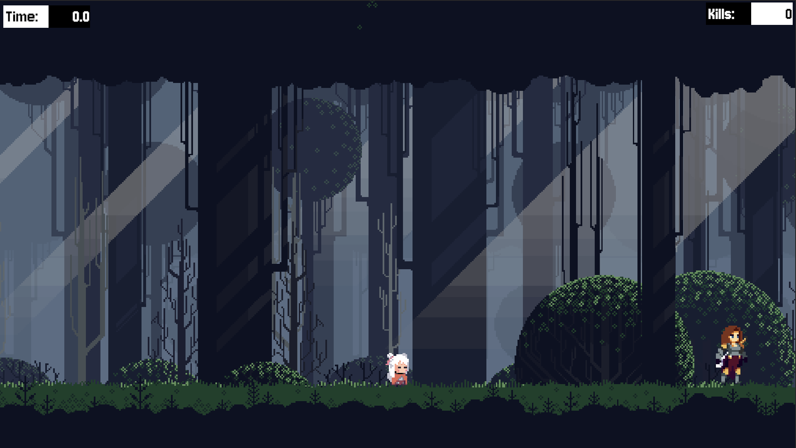
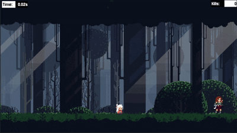

# Defend The Protector

Protect the NPC from endless waves of skeletons!

## Main UI
Main UI is simple.

- Contain Kills count, Timer, and at the center the Protector.
  
## Simple Game play

## How to Play
- Use **AD** to move
- Press **Space** to jump
- Press **Left Mouse button** to attack
- Survive as long as possible (you can set a score)
- Don't let the protector die! (10 hp) 
- Each enemy deals 1hp damage

## Features
- Fast-paced 2D combat
- Enemy AI with smart behaviors
- Timer pressure system
- Kill tracking

Built with Unity & C#.